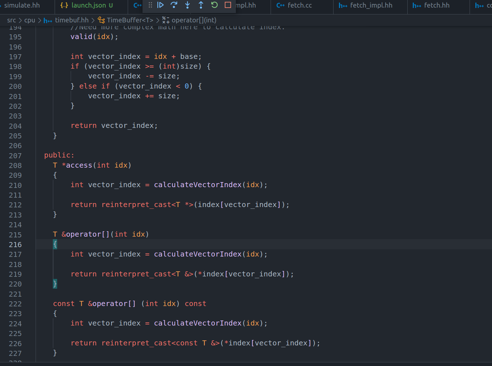

#ARVSIM 设计文档
> A RISC-V Simulator
## 存储建模
使用map<ppn, array<uint8_t>>建模

## 事件驱动模型
TimingCPU 继承自 EventManager

> 分析gem5中各个模块的依赖关系，比如取值是如何访问memory的，加载程序是如何存放到memory的？

## Key Notes
* Init processor instance in each stage
* 
## 实现学习记录
### 在Buffer中保存任意类型
